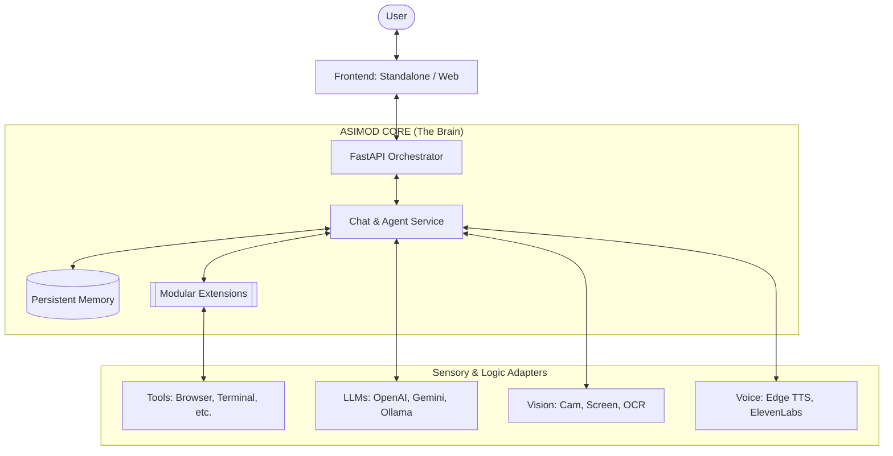

# ASIMOD Core 🤖🌌

**ASIMOD Core** (Advanced Sensory Integrated Multimodal Orchestrating Device) is a comprehensive, modular AI ecosystem designed to serve as the unified brain for digital life, autonomous agents, and interactive avatars.

Built on a robust **Ports & Adapters Architecture**, it seamlessly orchestrates Large Language Models (LLMs), Computer Vision, Speech-to-Text (STT), and Text-to-Speech (TTS) engines into a single, cohesive intelligence layer.

---

## 🏗️ System Architecture

ASIMOD follows a hexagonal architecture, ensuring that core logic remains isolated from external services and user interfaces.



---

## 🚀 Key Capabilities

### 🧠 Multimodal Intelligence
- **Vision:** See the world through webcams, capture your screen in real-time, or analyze uploaded images.
- **Audio:** High-performance STT and dual-mode TTS (Interrupt/Wait) for natural conversations.
- **Agentic Logic:** The "Brain" can autonomously trigger actions within its installed modules based on natural language commands.

### 💾 Persistent Persona Engine
- **Threaded Memory:** Infinite conversation threads with full CRUD management.
- **Character Profiles:** Each thread can have a unique personality, history, and voice configuration.
- **Context Awareness:** Deep memory integration allows the AI to remember long-term interactions and user preferences.

### 🌐 Remote & Local Control
- **Web Dashboard:** A professional-grade remote interface for monitoring and control from any device.
- **Standalone GUI:** A native Python application for ultra-low latency local interaction.
- **Public Access:** Built-in Cloudflare Tunnel support for secure, passwordless remote access via public URLs.

---

## 🧩 The Module Ecosystem

ASIMOD Core is highly extensible through its module system. Each module can provide both logic (tools) and its own custom UI widgets.

| Module | Description |
| :--- | :--- |
| **🎨 Media Generator** | Advanced AI workflows for generating Images, Videos, and 3D Assets. |
| **🩺 Health** | Biometric tracking and real-time status monitoring. |
| **📋 Projects** | Integrated task management and coordination hub. |
| **💬 Communications** | Centralized contact management and messaging bridge. |
| **🛠️ Utilities** | Essential tools: Notes, Terminal access, and System control. |

---

## 🖥️ Getting Started

### 1. Configuration
The system uses a `settings.json` file. Ensure you provide your API keys there:
```json
{
  "openai_key": "your-key",
  "gemini_key": "your-key",
  "ollama_url": "http://localhost:11434"
}
```

### 2. Execution Modes
- **Full Desktop UI:** `python main_standalone.py`
- **Lightweight Server:** `python main_headless.py`
- **Web Dashboard (Local Network):** Run `start_web_remote.bat`
- **Public URL Access:** Run `start_remote_public.bat`

---

## 🔌 API Documentation

ASIMOD exposes a rich REST API on port `8000`.

### Sensory & Chat
- `POST /v1/chat`: Send a multimodal message (Text + Vision).
- `POST /v1/audio/speak`: Trigger arbitrary TTS generation.
- `POST /v1/stt/mode`: Switch between generic chat, commands, and agent modes.

### Memory & Threads
- `GET /v1/memories`: List all conversation threads.
- `POST /v1/memories`: Create or switch to a thread.
- `PATCH /v1/memories/profile`: Update the active character's identity.

### Modules & Media
- `GET /v1/modules`: List active modules and their UI states.
- `POST /v1/modules/{id}/action`: Execute a modular tool (e.g., "Generate Image").
- `GET /v1/gallery`: Browse and manage generated files in the `output` folder.

---

## 🔒 Official Adapters (SDKs)

Ready-to-use clients for integrating ASIMOD into your favorite engine:
- **Unity (C#)**: `engine_adapters/UnityIntegration/`
- **Unreal (C++)**: `engine_adapters/UnrealIntegration/`
- **Godot (GDScript)**: `engine_adapters/GodotIntegration/`
- **Python**: `engine_adapters/PythonIntegration/`

---

Developed with ❤️ for the **ASIMOD Ecosystem**.
