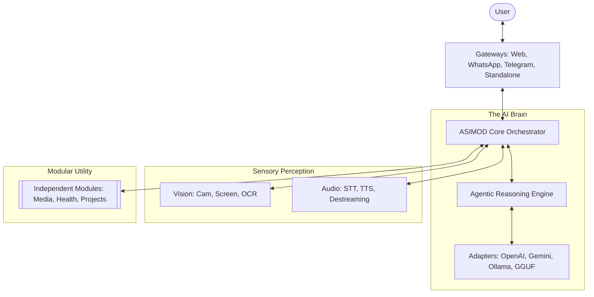
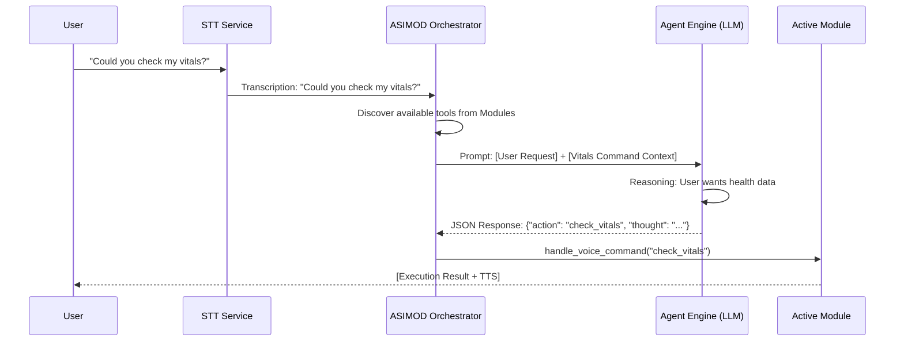

# ASIMOD Core: Universal Agentic Orchestrator 🤖🌌

**ASIMOD Core** (Advanced Sensory Integrated Multimodal Orchestrating Device) is a comprehensive framework for building autonomous, multimodal agents. It acts as a universal "brain" that can be specialized through modular plugins, connecting high-level reasoning with real-world sensors and communication channels.

---

## 🏗️ System Architecture: Ports & Adapters

ASIMOD is built on a Hexagonal Architecture (Ports & Adapters), ensuring that the core reasoning logic is completely decoupled from sensory implementations and external frontends.



---

## 🔌 The Integration Ecosystem

ASIMOD supports a wide array of providers right out of the box, allowing you to mix and match local and cloud-based services.

### 🧠 Language Models (LLM)
- **Cloud:** OpenAI (GPT-4o), Google Gemini, Anthropic Claude.
- **Local:** Ollama, GGUF (Direct load via llama.cpp), LLM Studio, OpenCode.

### 👂 Sensory Inputs (STT & Vision)
- **Speech-to-Text:** Whisper (OpenAI), Faster-Whisper (Local), Google Cloud STT.
- **Computer Vision:** Real-time Camera capture, Screen analysis, and local file processing.

### 🗣️ Voice Output (TTS)
- **Edge TTS:** High-fidelity, multilingual neural voices.
- **Local TTS:** Offline synthesis options.
- **Destreaming Logic:** Intelligent chunking of LLM responses for low-latency audio playback.

---

## 🌐 Connectivity & Gateways

ASIMOD isn't restricted to a single window. It can be accessed through multiple channels simultaneously:

- **Web Dashboard:** A professional FastAPI-powered remote interface.
- **Messaging:** Direct integration with **WhatsApp** and **Telegram** bot adapters.
- **Secure Remote Access:** Built-in **Cloudflare Tunnel** support for exposing the dashboard to a public URL without port forwarding.
- **Standalone GUI:** Ultra-low latency native Python interface (Tkinter).

---

## 🧩 The Module Framework

The power of ASIMOD comes from its **Module Independence**. You can create specialized tools that the Agent discovers and uses dynamically.

### Core Modular Features:
- **Dynamic Discovery:** The core automatically scans the `modules/` folder and injects module capabilities into the Agent's prompt.
- **Frontends Mounting:** Add a `web/` folder to your module, and it will be served automatically on the dashboard.
- **Lifecycle Management:** Dedicated `on_activate` and `on_deactivate` hooks for complex state management.

### Minimal Developer Boilerplate:
```python
from core.base_module import BaseModule

class MyTool(BaseModule):
    def __init__(self, chat_service, config, style, data_service=None):
        super().__init__(chat_service, config, style, data_service)
        self.name = "My Smart Tool"
        self.id = "smart_tool"
        self.icon = "🔧"

    def get_voice_commands(self):
        # Maps user intent to logic slugs (shared with the Agent)
        return {"activate engine": "run_logic"}

    def on_voice_command(self, action_slug, text):
        if action_slug == "run_logic":
            # Your custom logic here
            print("Action executed!")
```

---

## 🎤 The Voice & Agentic Command System

ASIMOD Core features a unique **Dual-Layer Command Architecture** that bridges the gap between simple speech recognition and complex natural language reasoning.

### 🔄 One Dictionary, Two Execution Paths
In every module, you define a dictionary of commands via `get_voice_commands()`. These commands serve two distinct purposes:

1.  **Path A: Direct Local Matching (Speed)**
    - When the system is in **CHAT** or **COMMAND** mode, it performs high-speed literal matching.
    - If you say the exact phrase (e.g., *"turn on engine"*), the core executes the action `start_logic` instantly, bypassing the LLM to save time and API costs.

2.  **Path B: Agentic Semantic Reasoning (Flexibility)**
    - When **AGENT** mode is active, the system doesn't just look for exact matches.
    - The `ModuleService` collects all command dictionaries and injects them into the LLM's system prompt as "Available Tools".
    - The LLM analyzes the **intent** of your request. You could say *"I'm ready to take off, start the thrusters"* and the LLM will reason that this matches the intent of the `start_logic` command.

### 🧩 The Agentic Flow Logic



### 🧠 Agent Reasoning Example
When in Agent mode, the LLM generates a structured JSON response to map your intent to the modular architecture:

```json
{
  "thought": "The user is concerned about their health status. I should use the vitals tool available in the Health module.",
  "response": "Of course, I'm checking your heart rate and oxygen levels now.",
  "action": "check_vitals",
  "params": null
}
```

### 💡 Developer Guidelines for "Agent-Ready" Commands
To ensure your modules work flawlessly with the Agentic Engine, follow these best practices:
- **Descriptive Triggers**: Use triggers that clearly describe the intent (e.g., use `"generate detailed portrait"` instead of just `"generate"`).
- **Contextual Awareness**: The Agent can see the names of all available modules. Use this to your advantage by giving your modules and commands semantic names.
- **Action Slugs**: Keep Action Slugs consistent. If multiple modules have similar actions, the Agent will use the `active_module` context to disambiguate.

---

## 🎨 Personalization & UX

- **Theme System:** Fully customizable aesthetics (Tokens, Fonts, Colors). Includes presets like `Midnight Purple` and `Dark Carbon`.
- **Command Dictionary:** A robust set of pre-mapped voice triggers for games, investigations, and system control.
- **Persistent Memory:** Infinite conversation threads with unique portraits, personalities, and histories.

---

## 🖥️ Execution Modes

- **Local UI:** `python main_standalone.py`
- **Headless Server:** `python main_headless.py`
- **Remote Hub:** `start_web_remote.bat`
- **Public URL:** `start_remote_public.bat`

---

## 🔧 Creating & Integrating Your Own Module

Drop a Python file (or folder) into the `modules/` directory. ASIMOD will auto-discover it at startup — no registration required.

### 📁 File Structure

Two valid structures:

```
modules/
├── my_module.py              # Option A: single file
└── my_module/                # Option B: package (recommended)
    └── __init__.py           # ← the system looks for this file
```

> ⚠️ Folders named `widgets` or starting with `__` are reserved and will be ignored.

---

### ✅ Minimum Requirements

Your class **must** inherit from `BaseModule` and be **defined locally** in the file (not imported from elsewhere):

```python
from core.base_module import BaseModule

class MyModule(BaseModule):
    def __init__(self, chat_service, config_service, style_service, data_service=None):
        super().__init__(chat_service, config_service, style_service, data_service)
        self.name = "My Module"     # Display name in the sidebar
        self.id   = "my_module"     # Unique ID — no spaces
        self.icon = "🚀"            # Emoji shown in the nav menu

    def get_widget(self, parent):   # REQUIRED: return a Tkinter Frame
        import tkinter as tk
        frame = tk.Frame(parent, bg=self.style.get_color("bg_main"))
        tk.Label(frame, text="Hello from My Module!",
                 fg=self.style.get_color("text_main"),
                 bg=self.style.get_color("bg_main")).pack(expand=True)
        return frame
```

---

### 🛠️ Optional Hooks

| Method | When it's called | Purpose |
|---|---|---|
| `get_widget(parent)` | When the module is displayed | **Required.** Returns the UI frame |
| `get_voice_commands()` | When the module activates | Register voice/agent commands |
| `on_voice_command(slug, text)` | When a voice command is detected | React to commands |
| `on_activate()` | When the user opens the module | Initialize state |
| `on_deactivate()` | When switching to another module | Clean up resources |

---

### 🧰 Available Services via `self`

| Attribute | What it provides |
|---|---|
| `self.chat_service` | LLM inference, STT, and TTS |
| `self.config_service` | Persistent settings (read/write) |
| `self.style` | Active theme colors and fonts |
| `self.data_service` | Shared SQLite database |

---

Developed with ❤️ for the **ASIMOD Ecosystem**.
