# ♟️ ASIMOD Chess: Tactical Intelligence Engine
> Integración de Ajedrez Profesional con Conciencia de Agente y Predicción Táctica.

Este módulo transforma el ajedrez clásico en un entorno de experimentación de IA avanzada, permitiendo tanto el juego tradicional como la delegación total a un Agente Cognitivo capaz de razonar estratégicamente.

---

## 🎨 Características de Diseño (Premium UI)

El módulo ha sido diseñado bajo los estándares estéticos de ASIMOD:
*   **Focus Mode**: Panel lateral colapsable con animación suave para maximizar el área de juego.
*   **Cerebro ASIMOD**: Panel dedicado de razonamiento estratégico en tiempo real.
*   **Barra de Evaluación**: Indicador visual dinámico de la ventaja posicional.
*   **Interfaz Híbrida**: Soporte nativo para escritorio (Tkinter) y Web (HTML5/Vanilla JS).

---

## 🧠 Predator Vision: El Agente Táctico

A diferencia de un motor tradicional (Stockfish), el **Agente ASIMOD** utiliza un modelo de lenguaje con visión táctica inyectada dinámicamente:

```mermaid
graph TD
    A[Tablero Actual] --> B{Analizador Táctico}
    B -->|Check| C[Alerta de Jaque]
    B -->|Threats| D[Detección de Amenazas]
    B -->|Captures| E[Oportunidades de Captura]
    C & D & E --> F[Prompt Enriquecido]
    F --> G(LLM / ASIMOD)
    G --> H[Thought: Razonamiento]
    G --> I[Action: move_piece]
    H --> J[Panel Cerebro]
    I --> K[Motor de Ajedrez]
```

### Capacidades Cognitivas:
- **Detección de Amenazas**: Identifica qué piezas propias están amenazadas por el rival.
- **Análisis de Capturas**: Diferencia entre piezas rivales "INDEFENSAS" y "Defendidas".
- **Memoria de Capturas**: Registra si el último movimiento del oponente resultó en la pérdida de material.
- **Formato Robusto**: Capacidad de interpretar coordenadas naturales, algebraicas y de captura sin errores de sintaxis.

---

## 🗣️ Interfaz de Voz y Comandos

El módulo está totalmente integrado con el núcleo de STT (Speech-to-Text) de ASIMOD:

| Comando | Acción |
| :--- | :--- |
| `Nuevo juego` | Reinicia el tablero y limpia el historial. |
| `Deshacer` | Retrocede un movimiento completo (Undo). |
| `Mover [A] [B]` | Mueve pieza por coordenadas (Ej: "Mover d2 d4"). |
| `Seleccionar` | Abre el menú de carga de partidas guardadas. |

> [!IMPORTANT]
> **Silencio Táctico**: Las notificaciones de razonamiento (`Thought`) son silenciosas para evitar ruidos molestos durante la partida, mientras que los errores críticos (movimientos ilegales) emiten un pitido de advertencia.

---

## 💾 Persistencia de Datos

El sistema gestiona la persistencia en `modules/ajedrez/data/games.json`, almacenando:
- Posición FEN completa.
- Historial de movimientos en formato SAN.
- Piezas capturadas para ambos bandos.
- Derechos de enroque y peones al paso.

---

## 🛠️ Notas para Desarrolladores (API)

Si deseas extender este módulo o invocar sus funciones desde el Core u otros Agentes:

1.  **`notify_system_msg(text, color, beep=False)`**: Úsalo para feedback visual en el chat.
2.  **`ask_asimod_agent(error_msg=None)`**: Dispara el ciclo de razonamiento del LLM.
3.  **`engine.get_fen()`**: Obtén el estado actual del juego para inyectar en otros contextos de IA.

---
*Desarrollado con ❤️ para el proyecto JaumarasProyects/asimod-core*
